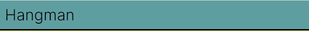

# Hangman - A portfolio project.

Welcome to my code institute milestone project. This is my second of such projects. For this milestone project, I was tasked with creating a webpage that was not only interactive but also offered some form of service, most often in the form of a game. In order to meet this goal, I decided to create a simple game of hangman featuring a robot rather than the typical figure. I chose to do this due to its simplicity and the potential for imagery unique to my site.

[The homepage of the website]

[Click here to access the live website](https://ccornfield.github.io/Hangman/)

## Table of Contents

1. [Planning & Development](#planning--development)
2. [Features](#features)
3. [Testing](#testing)
4. [Deployment](#deployment)
5. [Languages](#languages)
6. [Media Queries](#media-queries)
7. [Software](#software)
8. [Code](#code)
9. [Credits](#credits)

# Planning & Development #

### Business Strategy

When deciding on the game I was going to make I had already decided on making a word game. This was due to my relative confidence in working with arrays and their lasting popularity combined with the relative ease that they can be put together allowing for a reasonably quick completion time. It was also chosen due to it's prevalence in many major demographics.

### Target Audience

Like in my previous project I was not originally going into this with a market to aim for, not because it was a mock for anything; It was a serious project for showcasing my design and coding ability. It was moreso due to the knowledge that a game such as this did not need extensive marketing since it was a self-contained effort that served more like a sandbox than anything else. That being said it's important to understand it's potential reach in the event that such a concept needs be executed again in a more professional environment.

My research shows that 79% of people that search for hangman on facebook while the most popular age group featured on the website were those aged 65+ which accounted for 29% of all searches showing that the main market for hangman is older women, possibly retired.

### Seafood Keyword Search

* 29% Female demographic
* 65+ age range

Considering these parameters, while mobile will of course need to be considered and ensured that it is responsive in its design, due to the age range present a heavy focus on effective desktop design will also be a nessecity. Clear and simple controls with an uncluttered UI and a large, readable font will be essential in making the website as easy to use for older persons as possible.

### User Needs

#### User Stories
1. Be able to enter their username
2. Capeable of suggesting letters to the submission box
3. Easily understanding when they lose and win

### Site Objectives

* To make sure that site elements are easy to understand.
* Ensure that the web page is responsive and easy to interact with.
* To display a new image for every incorrect guess the player makes.
* To update HTML elements for every correct guess the player makes.
* Clearly denote where plays can submit letters and usernames.
* Allow the user to suggest a unique username for win and loss messages.
* Possess a color palette that is easy on the eyes.

### Research

While working on this site I did not do much research, this was because the design of my site was very laser focused into being a simple hangman game. Therefore in terms of site research, I refered to the portfolios of other code institute students as can be seen below.

[Yagavi1994](https://github.com/Yagavi1994/Wordle)
[kateuj](https://github.com/kateuj/coffee_cram)

I took notice of their design and incorporated elements of them into my own work.

### Wireframe

When putting together my website, my first port of call was to use balsamiq to create the wireframes that would allow me to plan out the look of my website and the respective elements that I wanted to be included. These designs were not final and they do look markedly different to the final project. This was due to worries about time constraints from struggles during the study period of the project. By simplifying certain elements and just keeping the wholly nessecary design elements I was able to ensure the project was done in a timely nature.

### Color Scheme

There wasn't a target market in mind at the time of the sites creation and since the site would only have a few distinct elements to ensure stood out, I used a palette with more muted colors while reserving the stronger colors for the more important elements that I wanted to ensure the player saw e.g. the header where the score would go and the hover highlight on the submit button to show they were about to click it. 

Yellow Green was not used on the site due to it's high saturation that would have clashed with the weaker colors on the sight and how it would blend into the background if used for the header and footer elements.

### Typography

For this project, due to it being a word game, I wanted to select a font that had very little embellishment and could be read clearly on both small phone screens and large desktop monitors. To this end I chose to use the Inter font due to it's clean appearance and ease of readability, as it was clearly readable even when the font was shrunk down to a smaller size for the purposes of reponsive design.

# Features #

### General

I have in large part been able to successfully make the site responsive by ensuring the text and images are at the appropriate time according to the size of the screen using google dev tools. 

### Username Screen

The above screen was created because it was suggested to me by my tutor that I should have an interactive element on the site that was not related to the game. Therefore I decided that it would be wise to allow the user to submit their own usernames so they could get personalized update on whether or not they won the game or did not guess the word in time.

### Header

The header for the site is very barebones, simply displaying a logo in the form of the name of the project. This was done in order to keep the CSS as simple and as functional as possible as too many elements may have disrupted the readability of other elements that require precise js to function.

### Updated Header

# Deployment #

In order to deploy my website, I used github pages. In order to use this service I had to do the following:

1. Go into my project repository
2. Click on the settings icon
3. Click on the source drop down and select the option "Deploy from branch"
4. In the branch drop down, select the option "main", this can be found in the root folder.
5. Select the folder dropdown a
6. Press the save button.
7. After reloading you should see that the site is live.
8. Click the visit site button or use the link provided to access the site at any time.

# Media Queries #

Media Queries were used exclusively in the role of increasing the responsiveness of web pages by shrinking the font size on the h2 elements and the size of the hangman image depending on the size of the screen.

# Software #

VS Code was used to create the website. It was the tool for typing out HTML and CSS code along with pushing site updates to the Github repository. Github and by extension Git was used to edit the website once it had been pushed to the repository while also being used to host the website and make it live.

Balsamiq was used to create the wireframes saw earlier in this readme.

The microsoft snipping tool was used to take the relevant screenshots.

# Credits #

Code Institute for the opportunity to learn and hone the craft of developing websites.

My loving and supportive family for supporting me in this endeavor.